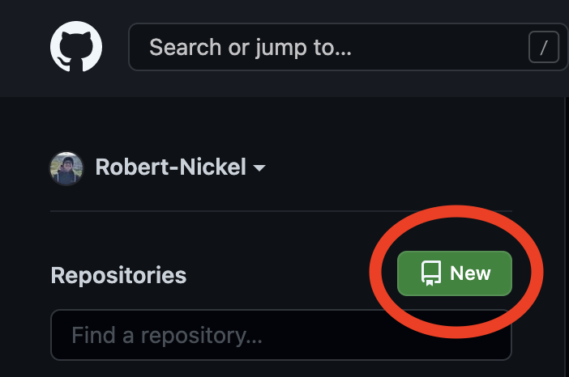
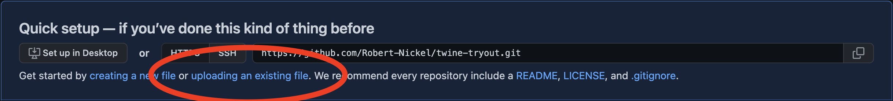
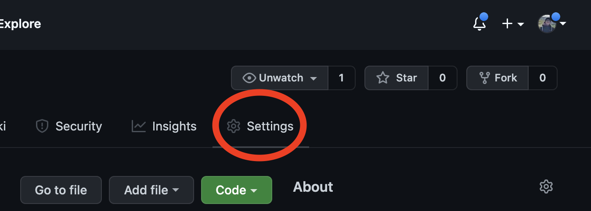
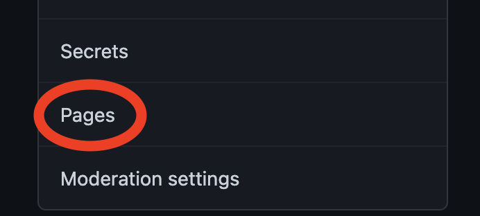
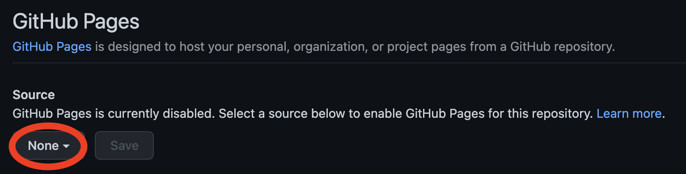
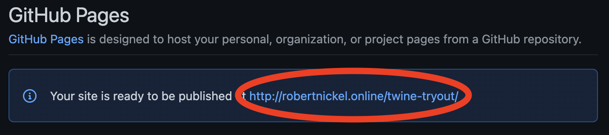

# Anleitung: Twine Geschichte als Webseite hosten

Das Ziel dieser Anleitung ist, dass du deine Twine Geschichte mittels GitHub Pages als Webseite hosten kannst. Ein Beispiel findest du auf [http://robertnickel.online/twine-example/](http://robertnickel.online/twine-example/)

1. Exportiere deine Geschichte aus Twine. Du hast jetzt eine HTML Datei und einige Bilder.
2. Benenne die HTML Datei um in `index.html`
3. Erstelle einen Account auf [GitHub](https://github.com)

    _Tipp: Nutze deine private Mailadresse, damit du den Account auch über die Laufzeit deines Studiums hinaus nutzen kannst_
4. Logge dich bei GitHub ein
5. Erstelle ein neues Repository:
    1. `New` oben links
    
    1. Repository Name = Name deiner Geschichte
    2. Alle anderen Einstellungen so lassen
6. Lade alle Dateien hoch, die zu deiner Geschichte gehören
    1. auf dem blauen Feld `uploading an existing file`
    
    2. Die index.html und alle Bilder auswählen
    3. `Commit changes`
7. Aktiviere nun GitHub Pages
    1. `Settings` oben rechts
    
    2. `Pages` unten links
    
    3. Als Source Branch wähle `main`
    
    4. Klicke `Save`
8. Nun taucht oben ein blaues Feld auf, indem du deine URL findest.

 
Warte eine Minute. Dann klicke darauf, um zu deiner Twine Geschichte auf deiner eigenen URL zu kommen. Du kannst diesen Link nun teilen. Die Geschichte ist dort immer verfügbar, bis du GitHub Pages wieder deaktivierst. 

_Wenn du die Anleitung verbessern möchtest, kannst du gerne [einen Pull Request stellen](https://github.com/Robert-Nickel/twine-to-server-tutorial/compare)._

